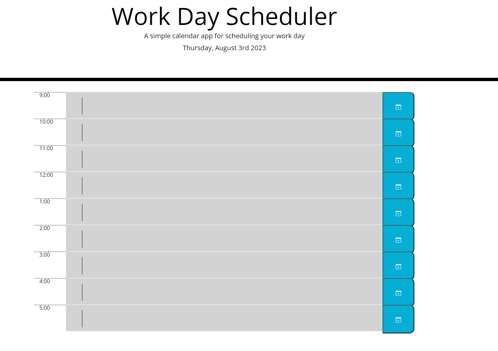

# Workday Scheduler

## Description 

Using starter code i proceded to use jQuery and javascript to make a functional work day scheduler. This application allows the user to create events/ tast based on the users local time.  Refreshing the page will not delete saved task.

## Screenshot 

The following image shows the application:

## URL

[Workday Scheduler](https://troyfoster0324.github.io/Troy-Foster-Work-Day-Scheduler/)

